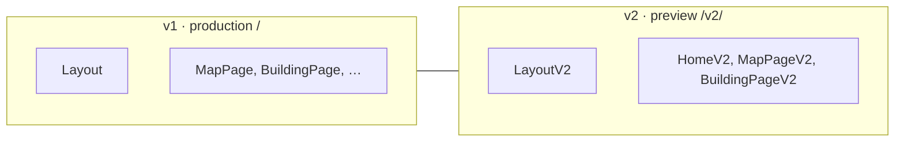

# Карта разработчика · «Чтение городской памяти»

Один взгляд: **где живёт логика**, **где живёт дизайн**, и **как связать Figma с кодом**.

---

## Короткий ответ

| Вопрос | Где делать |
|--------|------------|
| Маршруты, условия, данные, Archiview, карта | **Код в Git** (источник правды для логики) |
| Внешний вид, отступы, типографика, макеты экранов | **Figma** (источник правды для *дизайна*) |
| Связь «макет ↔ компонент» | **Код** + при желании **Code Connect** в Figma |
| Схема «что за чем идёт» для команды | **Figma** (страницы-схемы) **и** этот файл в `docs/` |

**Figma не заменяет репозиторий.** В Figma удобно *видеть и править* интерфейс целиком; в репозитории — *выполнять* поведение. Для разработчика сайта обычно нужны **оба**: файл Figma как «карта экранов» + `src/` как «карта логики».

---

## Два «мира» в этом проекте

| Версия | URL | Оболочка | Статус |
|--------|-----|----------|--------|
| **v1** | `/`, `/building/:id`, … | `src/components/Layout.tsx` | прод на GitHub Pages |
| **v2** | `/v2/`, `/v2/map`, `/v2/building/:id` | `src/v2/LayoutV2.tsx` | эксперимент (PR #152), Ordynka в стиле Arki |

Точка входа маршрутов: **`src/App.tsx`**.

---

## Все страницы (логика → файл)

### v1 (`Layout`)

| URL | Страница | Файл | Назначение |
|-----|----------|------|------------|
| `/` | Карта | `src/pages/MapPage.tsx` | Главная, Leaflet |
| `/method` | Метод | `src/pages/MethodPage.tsx` | Как устроен проект / Archiview |
| `/tour` | Тур | `src/pages/TourPage.tsx` | Маршрут по зданиям |
| `/explorer` | Explorer | `src/pages/ExplorerPage.tsx` | Обзор карточек |
| `/building/:id` | Карточка здания | `src/pages/BuildingPage.tsx` | Основная карточка v1 |
| `/building/:id/ar` | AR | `src/pages/ARPage.tsx` | AR-превью фасада |
| `/expert/:id` | Экспертиза | `src/pages/ExpertReviewPage.tsx` | Разбор следов |
| `/curator/:id` | → redirect | `App.tsx` | Редирект на `/expert/:id` |

### v2 (`LayoutV2`)

| URL | Страница | Файл | Назначение |
|-----|----------|------|------------|
| `/v2/` | Дом v2 | `src/v2/pages/HomeV2.tsx` | Витрина v2 |
| `/v2/map` | Карта v2 | `src/v2/pages/MapPageV2.tsx` | Карта с ссылками в v2 |
| `/v2/building/:id` | Карточка v2 | `src/v2/pages/BuildingPageV2.tsx` | Роутер карточки |
| ↳ `MOSCOW_001_kumaninykh` | Ордынка Arki | `src/v2/pages/building/OrdynkaArkiPage.tsx` | Отдельный макет + блоки A–E |
| ↳ остальные id | Карточка v2 default | `BuildingPageV2.tsx` (default) | Manifest / plates |

Стили v2: `src/v2/theme.css` (дом/карта), `src/v2/arki-theme.css` (Ордынка).

---

## Модули (переиспользуемая логика UI)

### Archiview / фасад (ядро карточки)

| Модуль | Файл | Что делает |
|--------|------|------------|
| Панель фасада | `src/components/ArchiviewFacadePanel.tsx` | Номера регионов, hover, overlay |
| Слои времени | `src/components/FacadeTimeLayers.tsx` | Кроссфейд исторических слоёв |
| Выбор сравнения | `src/components/ArchiviewComparisonPicker.tsx` | cmp_005 / 008 / 009 |
| Hotspot viewer | `src/components/FacadeHotspotViewer.tsx` | Точки на фасаде (v1) |
| До/после | `src/components/FacadeBeforeAfterSlider.tsx` | Слайдер |
| AR | `src/components/FacadeARPreview.tsx` | AR |

### Данные и геометрия

| Модуль | Файл |
|--------|------|
| Список зданий | `src/data/buildings/index.ts` + `moscow00*.ts` |
| Manifest explorer | `src/data/explorer/explorerManifest.ts` |
| Пути к ассетам | `src/data/explorer/archiviewAssets.ts` |
| Публичные JSON/PNG | `public/explorer/MOSCOW_00*/` |
| Размещение плашек | `src/lib/tracePlatePlacement.ts`, `regionBadgeLayout.ts` |
| Цвета классов L/K/A | `src/lib/archiviewClassColors.ts` |

### v2 UI-кирпичи

| Компонент | Файл |
|-----------|------|
| Секция | `src/v2/components/V2Section.tsx` |
| Manifest plate | `src/v2/components/V2Plate.tsx` |
| Квадрат-маркер | `src/v2/components/V2SquareMark.tsx` |
| Достоверность | `src/v2/components/V2ConfidenceBadge.tsx` |

### Общее

| Модуль | Файл |
|--------|------|
| Карта | `src/components/MapView.tsx` (+ prop `buildingTo` для v2) |
| Таймлайн | `src/components/TransformationTimeline.tsx` |
| Типы | `src/types/building.ts` |

---

## Где разрабатывать дизайн в Figma

Рекомендуемая структура **одного design-файла** (можно собрать скриптами из `docs/design/ordynka-figma-kit/` + доп. страницы вручную):

| Страница Figma | Содержание |
|----------------|------------|
| **00 · Карта сайта** | Все URL v1/v2, стрелки, какой файл в `src/` |
| **01 · Схема проекта** | Архитектура (уже есть скрипт `02-project-scheme.js`) |
| **02 · Design tokens** | Цвета, шрифты (`design-tokens.json`, `arki-theme.css`) |
| **03 · v1 экраны** | Map, Building (generic), Method, … — по одному фрейму |
| **04 · v2 экраны** | Home, Map, Building default |
| **05 · Ordynka карточка** | Блоки A–E (`04-card-layers.js`, `layer-tree.json`) |
| **06 · Референс** | Скрин с превью / `generate_figma_design` |

**В Figma правите:** сетку, типографику, состав блоков, подписи, состояния (hover, active).

**В коде правите:** загрузку manifest, роутинг, слайдеры, фильтры, API нет — всё статика + JSON.

Словарь блоков Ордынки (A–E): `docs/design/ordynka-figma-kit/layer-tree.json` и `FIGMA_IMPORT_RU.md`.

Создание файла через MCP: **`docs/design/ordynka-figma-kit/ЗАПУСК_В_FIGMA.md`** (только **Cursor Desktop** с подключённой Figma).

---

## Рабочий процесс разработчика

1. **Понять поведение** — `App.tsx` → страница → данные в `src/data/` → компоненты в `src/components/`.
2. **Понять вид** — Figma-фрейм экрана **или** превью:  
   `npm run dev` → http://localhost:5173/chtenie-gorodskoy-pamyati/
3. **Менять дизайн** — правки в Figma → задача агенту/себе с кодом блока (`B2`, `C1c`) → правки в `OrdynkaArkiPage.tsx` / CSS.
4. **Не ломать прод** — v2 под `/v2/`; v1 остаётся на `/` до явного merge.

Инструменты вне сайта (не в Figma): **`tools/archiview-cv/`** — разметка фасадов на Windows; см. `AGENTS.md`.

---

## Связанные документы

| Документ | Зачем |
|----------|--------|
| [design/ordynka-figma-kit/FIGMA_IMPORT_RU.md](./design/ordynka-figma-kit/FIGMA_IMPORT_RU.md) | Импорт и слои карточки Ордынки |
| [design/SITE_FIGMA_BLUEPRINT_RU.md](./design/SITE_FIGMA_BLUEPRINT_RU.md) | Полный blueprint Figma-файла сайта |
| [PREVIEW_DEPLOY_RU.md](./PREVIEW_DEPLOY_RU.md) | Превью PR на GitHub Pages |
| [../AGENTS.md](../AGENTS.md) | Запуск, base path, Archiview |

---

## Ответ на «всё в Figma?»

- **Да** — если цель: *увидеть все экраны, иерархию слоёв, токены, согласовать визуал* с командой или с агентом по скриншотам.
- **Нет** — если цель: *как работает выбор comparison, откуда timeline, куда ведёт карта* — это только в **коде**; в Figma можно подписать ссылкой на файл (`BuildingPageV2.tsx`).

Идеальная схема для вас как разработчика: **Figma = визуальная карта продукта**, **Git = исполняемая карта**. Держите имена слоёв в Figma такими же, как коды A–E и имена роутов — тогда правки не теряются между инструментами.
